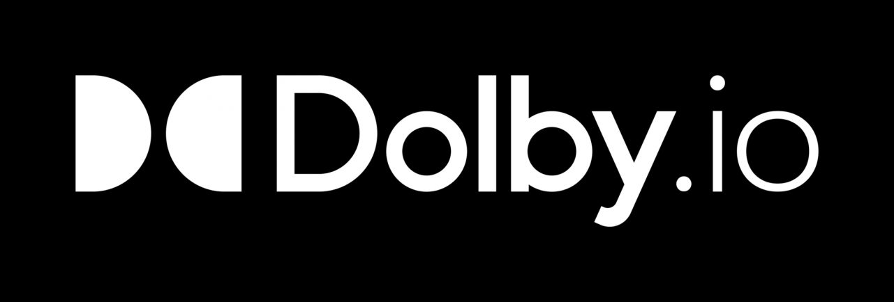

# Dolby Interactivity APIs Mixer Layout App

<p align="center">

</p>

## Concept

A mixer layout app is a web app that the Dolby Interactivity APIs Platform (the Platform) can use to determine the display for a video presentation of a conference.
The mix can be of either a live conference or of a conference that has been recorded.
The result can be an MP4 video file or can be streamed to an RTMP endpoint (like YouTube, Facebook...) or using `HTTP Live Streaming` (HLS).

The resulting presentation can contain the video from each participant, as well as screens, files or videos being shared, and the size and position of each is under the control of the layout app.
As participants join and leave, start and stop video streams or screen, file or video sharing, the layout app is updated with these changes, allowing for a dynamic layout.

The layout does not need to be constant and can change depending on who is talking or who is sharing a screen.
For example, the layout may be equal sized tiles for the majority of the video but when a screen is being shared, the layout could change to show only that screen.

1. The Platform communicates with the layout app by filling out input fields and “clicking” buttons.
   The input fields are used to define the details of the conference to be used to produce the presentation.
   When one of the buttons is clicked, the layout app takes the values in these fields to connect to the conference or the recording.

   These inputs and buttons are required and in this app they are found in the file `src/app/components/ConferenceRoom.js`.

   ```html
   <input
     type="hidden"
     value="accessToken"
     id="accessToken"
     name="accessToken"
   />
   <input
     type="hidden"
     value="refreshToken"
     id="refreshToken"
     name="refreshToken"
   />
   <input type="hidden" value="catToken" id="catToken" name="catToken" />
   <input type="hidden" value="voxeet" id="conferenceId" name="conferenceId" />
   <input type="hidden" value="refreshUrl" id="refreshUrl" name="refreshUrl" />
   <input type="hidden" value="1234" id="thirdPartyId" name="thirdPartyId" />
   <input type="hidden" value="stream" id="layoutType" name="layoutType" />
   <button id="joinConference" onClick="{this.launchConference.bind(this)}">
     Join conference
   </button>
   <button
     id="replayConference"
     onClick="{this.launchReplayConference.bind(this)}"
   >
     Replay conference
   </button>
   ```

   The Platform triggers either the `joinConference` button or the `replayConference` button, depending on whether the conference is live or a replay.
   The mixer layout then uses the Dolby Interactivity APIs Web SDK to join the conference as a mixer and creates the layout based on the number and state of the participants in the conference.

2. The Platform needs to know when the layout has been prepared for the mix to begin and when the conference is over.
   This is done by the layout app presenting `div`s with specific `id`s. The Platform looks for:

   - `<div id="conferenceStartedVoxeet"></div>`. By adding this element into the DOM, the layout app indicates it is ready for the mix to begin.
   - `<div id="conferenceEndedVoxeet"></div>`. By adding this element into the DOM, the layout app indicates that the conference is over.

   In this layout app, these `div`s are created in `ConferenceRoom.js`.

3. There are four possible layout types that can be requested of the mixer layout app. These are:

   - `record`, which is used to record live conference;
   - `replay`, which is used to record a replay of a conference;
   - `stream`, which is used to stream to YouTube or Facebook; or
   - `hls`, which is used for streaming using HLS.

   The mixer layout can vary the layout based on the type.
   For example, for a live recording of a conference, the Platform will set the values for the input with id `layoutType` to `record`.
   The mixer layout can then present the appropriate layout for this situation.

## Project setup

- Download the project with:

  ```bash
  git clone git@github.com:voxeet/voxeet-uxkit-web-mixerlayout.git
  ```

- Install the dependencies with:

  ```bash
  yarn install
  ```

- Start the application with:

  ```bash
  yarn start
  ```

## Test

This app has a demonstration mode which can be used to view the layout in Chrome, which is the only supported browser.
This mode can be used with a live conference or with a replay of a recorded conference.

_Note: Don’t forget to disable the testing mode before pushing into production._

1. At the bottom of `src/app/components/ConferenceRoom.js`, the default values are set for the properties that are used in demo mode.
   These are `isDemo`, `consumerKey` and `consumerSecret`.
   Change the default value for `isDemo` to `true` and set the `consumerKey` and `consumerSecret` value your app’s values.

2. Start the server

```bash
yarn start
```

3. Launch Chrome and go to `http://127.0.0.1:8081/`. The layout type can be selected and a mix started:

- To connect to a live conference, enter the conference name and click `Join Conference`.
- To use a replay of an earlier conference, enter the conference replay ID and click `Replay conference`.

## Customize

This Dolby.io Mixer Layout app uses React with Redux. The source is in `src/app` and the CSS styles are defined in `scr/styles/css/index.css`.

### Components

The mixer layout is determined by the components contained in the app and these are JavaScript `.js` files located in `src/app/components`.
The top level of the app’s structure is `src/app/index.js` and this adds the top level component, `ConferenceRoom`.

#### `ConferenceRoom`

This component is the entry point of the mixer’s layout logic. The component takes the state of the conference to produce the output.

When the mixer is not in a conference, this component contains the input fields and buttons listed above.

When the mixer is in a conference, those input fields and buttons are removed.
In their place the mixer layout’s layout consists of other components that reflect the state of the conference. These components are listed below.

As the conference state changes, the `ConferenceRoom` component updates the layout.
For example, if the layout is showing a tile for each participant, when the conference has a new participant join, a new tile is added for that participant,
and the existing tiles are resized and rearranged to make room in the layout.

The `ConferenceRoom` component creates the layout using other components:

- a `Tile` component is used for each participant when there are no screens being shared or file or video presentations displayed.
- a `TileVideoPiP` component is used for each participant when a screen is being shared or a file or video presentations is displayed.
- a `ScreenShareMode` component is used when a screen is being shared or a file or video presentations is displayed and this is used to show that stream.

The layout used is selected based on the situation. Factors considered include:

- number of conference participants with video
- files being presented
- participants sharing a screen
- demo mode active

The app then starts listening for update from the Platform about changes in the conference. For example, participants joining, starting videos or screenshare, and so on.
The layout is formed using the other components.

#### `Tile`

This component is used for a classic conference with presenters (depending on the number of participant). The layout will re-render when a new presenter joins the conference. This uses the `TileVideo` component internally.

#### `ScreenShareMode`

This component is used when a screen share, file presentation or video presentation is showing. The layout will change depending on the situation.
This uses one of the following for the presentations: `TileVideoScreenShare`, `TileFilePresentation`, and `TileVideoPresentation`.

#### `TileVideoPiP`

This component is used to show a “Picture in picture” (PIP) video while the conference is showing a screen share, file presentation or video presentation.
It uses the `AttendeesParticipantVideoPiP` component internally.

##### `TileVideo`

This component is used to show either the video from a participant using `AttendeesParticipantVideo`) or an avatar with a talking indicator (using `AttendeesParticipantVuMeter`).

##### `TileVideoPresentation`

This component is used by `ScreenShareMode` to show a video presentation.

##### `TileFilePresentation`

This component is used by `ScreenShareMode` to show a file presentation.

##### `TileVideoScreenShare`

This component is used by `ScreenShareMode` to show a screen share.

##### `AttendeesParticipantVideoPiP`

This component is used by `TileVideoPiP` to show the PiP video.

##### `AttendeesParticipantVideo`

This component is used by `TileVideo` to show a presenter who has camera video turned on.

##### `AttendeesParticipantVuMeter`

This component is used by `TileVideo` to show a presenter who does not have camera video turned on. This displays an avatar with a talking indicator.

### Actions / Reducers

- `ConferenceActions.js`/`ConferenceReducer.js`
  This action and reducer contain all events from the Platform (participant join, left, start screenshare, ...)

- `ParticipantActions.js`/`ParticipantReducer.js`
  This action and reducer contain all information about CONNECTED users

- `ParticipantWaitingActions.js`/`ParticipantWaitingReducer.js`
  This action and reducer is for ‘waiting’ participants, when a user is not yet connected or is a listener.

## Generate Bundle

To generate a bundle of the JavaScript of the project, in the root directory of the app run:

```bash
yarn run build
```

This will generate `dist/index.html` and `dist/out.js`.

## Host and deploy

To request the Platform to use your layout app, you will need to host and deploy the app.

- When your layout is deployed, go to your account on `https://dolby.io/dashboard/applications/summary`.
- Select your application from the list on the left and then select the `Interactivity APIs` section.
- Under the `Settings` tab, set the `Recording Mixer Layout URL` in the `Recording` section. Set the other options as needed.

## Dependencies

- [Voxeet Web SDK](https://www.npmjs.com/package/@voxeet/voxeet-web-sdk) - The WEB SDK Voxeet to communicate with Voxeet Servers
- [ReactJS](https://reactjs.org/) - A JavaScript library for building user interfaces
- [Redux](https://redux.js.org/) - Redux is a predictable state container for JavaScript apps.
- [Webpack](https://webpack.js.org/) - Bundle your project

© 2021 Dolby Laboratories
